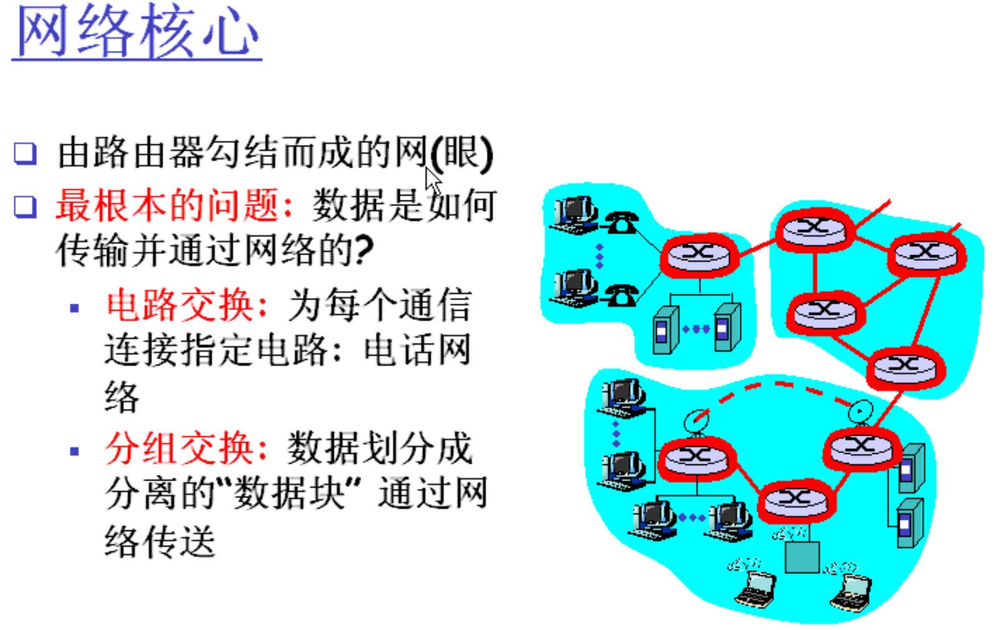

# 计算机网络与因特网概述

## 目标

- 了解环境，“感觉”网络
- 为课程内容进行铺垫
- 使用方法
  - 全面讲解网络要点
  - 使用因特网作为实例

- 教科书参考

  - 第一章

  - 第二章

## 概述

- 什么是因特网

- 什么是协议

  - 协议定义网络实体之间信息收发的格式和顺序，以及信息发送和接收后所需要采取的动作。

  - 语法、语义、同步或规则

  - > 网络实体：绝大部分指的是软件，最终落到某个进程上

- 网络边缘

- 访问网络，物理介质

- 网络性能

  - 数据丢失，延迟

- 协议分层，服务模型

- 骨干网络，NAP， ISP

- 因特网间史

> ISP: 互联网服务提供商(Internet Service Provider) 
>
> Regional ISP: 区域性互联网服务提供商

> 无连接：类似电报服务
>
> 面向连接：类似打电话

> 网络核心：也被称为通讯之网

> 端接系统：end

> FDMA 频谱划分；TDMA 时隙划分

> 这里的端指的是“进程”

