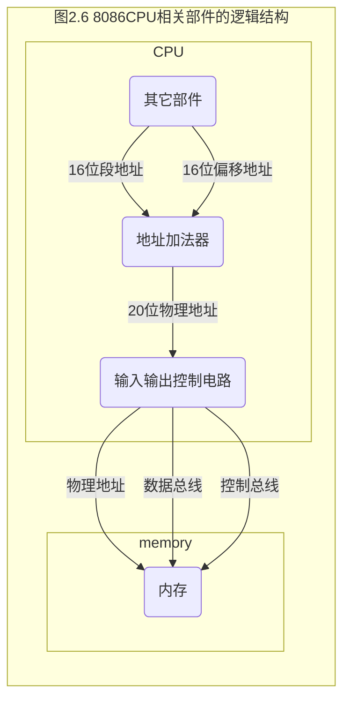

# 汇编语言


## 第一章: 基础知识

### 1.3 汇编语言的组成

- 汇编指令：机器码的助记符，有对应的机器码。
- 伪指令：没有对应的机器码，由编译器执行，计算机并不执行。
- 其它符号：如 `+` `-` `*` `/`等，由编译器识别，没有对应的机器码。

> 汇编语言的核心是汇编指令，它决定了汇编语言的特性。


#### 小结（1.1~1.10）

1）. 汇编指令是机器指令的助记符，同机器指令一一对应。

2）. 每一种 CPU 都有自己的汇编指令集。

3）. CPU 可以直接使用的信息在存储器中存放。

4）. 在存储器中指令和数据没有任何区别，都是二进制信息。

5）. 存储单元从零开始顺序编号。

6）. 一个存储单元可以存储 8 个 `bit`,即 8 位二进制数。

7）. 1Byte=8bit 	1KB=1024B	1MB=1024KB	1GB=1024MB

8）. 每一个 CPU 芯片都有许多管脚，这些管脚和总线相连。也可以说，这些管脚引出总线。一个 CPU 可以引出 3 中总线的宽度标志了这个 CPU 的不同方面的性能

- 地址总线的宽度决定了 CPU 的寻址能力
- 数据总线的宽度决定了 CPU 与其它器件进行数据传送时的一次数据传送量
- 控制总线的宽度决定了 CPU 对系统中其它器件的控制能力


#### 检测点 1.1

（1） 1个CPU的寻址能力为8KB，那么他的地址总线的宽度为【 **13** 】。
（2） 1KB的存储器有 【 **1024** 】个存储单元。存储单元编号从【 **0000** 】到【 **1023** 】。
（3） 1KB的存储器可以存储【 **1024 x 8** 】个bit，【 **1024** 】个Byte。
（4） 1GB、1MB、1KB分别是【**1024x1024x1024、1024x1024、1024** 】Byte。
（5） 8080、8088、8026、80386的地址总线宽度分别为16根、20根、24根、32根，则他们的寻址能力分别为：【 **64** 】(KB)、【 **1** 】(MB)、【 **16** 】(MB)、【 **4** 】(GB)。
（6） 8080、8088、8086、8026、80386的数据总线宽度分别为8根、8根、16根、16根、32根。则它们一次可以传送的数据为：【 **1** 】(B)、【 **1** 】(B)、【 **2** 】(B)、【 **2** 】(B)、【 **4** 】(B)。 

（7） 从内存中读取1024字节的数据，8086至少要读【 **512** 】次，80386至少要读【 **256** 】次。

（8）在存储器中，数据和程序以【 **二进制码** 】形式存放。


#### 内存地址空间

最终运行程序的是 CPU，我们用汇编语言编程的时候，必须要从 CPU 的角度考虑问题。对 CPU 来讲，系统中的所有存储器中的存储单元都处于一个系统的逻辑存储器中，它的容量受 CPU 寻址能力的限制。这个逻辑存储器即是我们所说的内存地址空间。


## 第二章: 寄存器

### 2.1 通用寄存器

8086 CPU 的所有寄存器都是16位的，可以存放两个字节。 AX、BX、CX、DX这4个寄存器通常用来存放一般性的数据，被称为通用寄存器。

AX、BX、CX、DX这4个寄存器都可分为两个独立使用的8位寄存器来用：

- AX 可以分为 AH（8位~15位） 和 AL（0位 ~7位）
- BX 可以分为 BH 和 BL
- CX 可以分为 CH 和 CL
- DX 可以分为 DH 和 DL


### 2.2 字在寄存器中的存储

8086 CPU 可以一次性处理以下两种尺寸的数据

- 字节：记为 byte，一个字节由 8 个bit组成，可以存在8位寄存器中
- 字：记为 word，一个字由两个字节组成，这两个字节分别称为这个字的高位字节和低位字节


### 2.3 几条汇编指令

在写一条汇编指令或一个寄存器的名称时不区分大小写。如: `mov ax, 18` 和 `MOV AX, 18`的含义相同。

| 汇编指令   | 控制CPU完成的操作                  | 用高级语言的语法描述 |
| :--------- | :--------------------------------- | :------------------- |
| mov ax, 18 | 将18送入寄存器AX                   | AX=18                |
| mov ah, 78 | 将78送入寄存器AH                   | AH=78                |
| add ax, 8  | 将寄存器AX中的数值加上8            | AX=AX+8              |
| mov ax, bx | 将寄存器BX中的数据送入寄存器AX     | AX=BX                |
| add ax, bx | 将AX和BX中的数值相加，结果存在AX中 | AX=AX+BX             |


### 检测点 2.1

(1). 写出每条汇编指令执行后相关寄存器中的值

```assembly
mov ax, 62627			; AX=F4A3H
mov ah, 31H 			; AX=31A3H
mov al, 23H				; AX=3123H
add ax, ax				; AX=6246H
mov bx, 826CH			; BX=826CH
mov cx, ax				; CX=6246H
mov ax, bx				; AX=826CH
add ax, bx				; AX=04D8H
mov al, bh				; AX=0482H
mov ah, bl				; AX=6C82H
add ah, ah				; AX=D882H
add al, 6					; AX=D888H
add al, al				; AX=D810H
mov ax, cx				; AX=6246H
```

(2) 只能呢个使用目前学过的汇编指令，最多使用4条指令，编程计算2的4次方

```assembly
mov ax, 2		; AX = 2H
add ax, ax	; AX = 4H
add ax, ax	; AX = 8H
add ax, ax	; AX = 10H
```


### 2.4 物理地址

CPU 访问内存单元时，要给出内存单元的地址。所有的内存单元构成的存储空间是一个一维的线性空间，每一个内存单元在这个空间中都有唯一的地址，我们将这个唯一的地址称为物理地址。8086CPU在内部用段地址和偏移地址移位相加的方式形成最终的物理地址。

CPU 通过地址总线送入寄存器的，必须是一个内存单元的物理地址。在 CPU 向地址总线上发出物理地址之前，必须要在内部先形成这个物理地址。不同的CPU可以有不同的形成物理地址的方式。


### 2.5 16位结构的CPU

16位结构的 CPU能够一次性处理、传输、暂时存储的信息的最大长度是16位的。内存单元的地址在送上地址总线之前，必须在 CPU 中处理、传输、暂时存放，对于16位CPU， 能一次性吹来、传输、暂时存储16位的地址。


### 2.6 8086CPU 给出物理地址的方法

8086 CPU 有20位地址总线，可以传送20位地址，达到 1MB寻址能力。 8086CPU 又是 16位结构，在内部一次性处理、传输、暂时存储的地址为16位。从8086CPU的内部结构来看，如果将地址从内部简单的发出，那么它只能送出16位的地址，表现出的寻址能力只有 64KB。


8086CPU 采用一种在内部用两个 16位地址合成的方法来形成一个 20 位的物理地址。



如上图， 当8086CPU要读写内存时

1. CPU 中的相关部件提供两个 16 位地址，一个称为段地址，另一个称为偏移地址
2. 段地址和偏移地址通过内部总线送入一个称为地址加法器的部件
3. 地址加法器将两个16地址合成一个20位的物理地址
4. 地址加法器通过内部总线将20位物理地址送入输入输出控制电路
5. 输入输出控制电路将20位物理地址送上地址总线
6. 20位物理地址被地址总线传送到存储器

地址加法器次采用 **物理地址=段地址x16 + 偏移地址** 的方法合成物理地址。

#### 段地址 x 16 引发的讨论

“段地址x16”有一个更常用的说法是左移 4 位；机器只能处理二进制信息，“左移4位”中的位，指的是二进制位。

- 一个数据的二进制形式左移 N 位，相当于该数据乘以 2 的 N 次方
- 地址加法器如何完成段地址x16的运输？就是将以二进制形式存放的段地址左移4位


### 2.7 段地址x16 + 偏移地址=物理地址 的本质含义

其本质含义是：`CPU`在访问内存时，用一个基础地址（段地址 * 16）和一个相对于基础地址的偏移地址相加，给出内存单元的物理地址。

8086CPU的 物理地址公式：

- 物理地址 = 段地址 * 16(10H) + 偏移地址 

- 物理地址 = 基础地址 + 偏移地址

- 基础地址 = 段地址 x 16 = 段地址左移一位

### 2.8 段的概念

内存并没有分段，段的划分来自于 CPU，由于 8086 CPU用 “基础地址（段地址 x 16）+ 偏移地址 = 物理地址“ 的方式给出内存单元的物理地址，使得我们可以用分段的方式来管理内存。

- 段地址 x 16 必然是16的倍数，所以一个段的起始地址也一定是16的倍数；

- 偏移地址为16为，16位地址的寻址能力为64KB， 所以一个段的长度最大为64KB。


### 内存单元地址小结

CPU 访问内存单元时，必须向内存提供内存单元的物理地址。8086CPU 在内部用段地址和偏移地址移位相加的方法形成最终的物理地址。

- CPU 可以用不同的段地址和偏移地址形成同一个物理地址。

  - 比如CPU 要访问 21F60 单元，则它给出的段地址 SA 和 偏移地址 EA 满足 SA x 16 + EA = 21F60H 即可

- 如果给定一个段地址，仅通过变化偏移地址来进行寻址，最多可以定位多少个内存单元？

  - 偏移地址16位，变化范围为 0~FFFFH，仅用偏移地址来寻址最多可寻 64KB 个内存单元

- 在8086PC机中，“数据在21F60H内存单元中”这句话一般按照下面的方式描述

  - 数据存在内存 2000:1F60 单元中

  - 数据内在内存的 2000H 段中的 1F60H 段元中


### 检测点 2.2

1. 10H ~ 1000FH
2. 1001H ~ 2000H


### 2.9 段寄存器

8086CPU 有4个段寄存器: **`CS` `DS` `SS` `ES`**; 当8086CPU 要访问内存时由这4个段寄存器提供内存单元的段地址。


### 2.10 CS 和 IP

CS 为代码段寄存器，IP为指令指针寄存器，它们指示了 CPU 当前要读取指令的地址。

在 8086 PC 机中，任意时刻，设CS 中的内容为 M, IP 中的内容为N，8086CPU将从内存 Mx16 + N 单元开始，读取一条指令并执行。也可以表述为：8086机中，任意时刻，CPU 将CS:IP 指向的内容当作指令执行。

- CS 为代码段寄存器，IP 为指令指针寄存器。在8086PC机中，任意时刻，CPU将 CS:IP 指向的内容当作指令执行。
- 任意时刻，设CS中的内容为M, IP中的内容为N, 8086CPU 将从内存M x 16 + N单元开始，读取一条指令并执行。


8086 CPU的工作过程可以简要描述如下

1）从 CS:IP 指向的内存单元读取指令，读取的指令进入指令缓冲器

2）IP = IP + 所读取的指令的长度，从而指向下一条指令

3）执行指令。转到步骤1，重复这个过程


### 2.11 修改 CS、IP的指令

8086CPU修改 CS, IP 指令的值采用 `jmp` 指令。若想同时修改 CS IP 的内容，可用形如 `jmp 段地址:偏移地址`的指令完成。

> jmp 段地址:偏移地址 指令的功能为: 用指令中给出的段地址修改 CS, 偏移地址修改 IP。 `jmp` 也被称为转移指令


若要修改IP的内容，可用形如 `jmp 某一合法寄存器`的指令完成; 如

```assembly
jmp ax, ; 指令执行前: AX=1000H, CS=2000H, IP=0003H
			  ; 指令执行后: AX=1000h, CS=2000H, IP=1000H (用寄存器中的值修改IP)
jmp bx, ; 指令执行前: BX=0B16H, CS=2000H, IP=0003H
				; 指令执行后: BX=0B16H, CS=2000H, IP=0B16
```


在8086CPU 加电启动或复位后（既CPU刚开始工作时）CS 和 IP 被设置为 CS=FFFFH, IP=0000H,即在8086PC 机刚启动时，CPU从内存 FFFF0H单元中读取指令执行，FFFF0H单元中的指令是 8086 PC 开机后执行的第一条指令。


## 第三章: 寄存器（内存访问）

### 3.1 内存中的字存储

> 内存单元是字节单元（一个单元存放一个字节），则一个字需要用到两个连续的内存单元来存放，这个字的低位字节存放在低地址单元中，高位字节存放在高地址单元中。


字单元的概念：字单元，即存放一个字型数据（16位）的内存单元，由两个地址连续的内存单元组成。高地址内存单元中存放字型数据的高位字节，低地址单元中存放字型数据的低位字节。


### 3.2 DS 和 [address]

> DS 寄存器：通常用来存放要访问数据的段地址。

将一个内存单元中的内容送入一个寄存器中： mov 寄存器名, 内存单元地址

- `[...]` 表示一个内存单元， `[...]` 中的数字表示内存单元的偏移地址。


### 3.3 字的传送

8086 CPU 是16位结构，有16根数据线，所以可以一次性传送16位的数据，也就是说可以一次性传送一个字。只要在 mov 指令中给出 16 位的寄存器就可以进行16位数据的传送。


### 3.4 mov、add、sub 指令

- `mov` 指令的几种形式; add 和 sub指令同 `mov` 一样，都有两个操作对象

| 汇编指令                | 示例        |
| :---------------------- | :---------- |
| mov 寄存器, 数据        | mov ax, 8   |
| mov 寄存器, 寄存器      | mov ax, bx  |
| mov 寄存器, 内存单元    | mov ax, [0] |
| mov 内存单元, 寄存器    | mov [0], ax |
| mov 段寄存器, 寄存器    | mov ds, ax  |
| mov 寄存器, 段寄存器    | mov ax, ds  |
| mov 内存单元, 段寄存器  | mov [0], cs |
| mov 段寄存器, 内存单元, | mov ds, [0] |


### 3.5 数据段

可以将一组长度为N（N<=64KB）地址连续、起始地址为16的倍数的内存单元当作专门存储数据的内存空间，从而定义了一个数据段。将一段内存当作数据段，使我们在编程时的一种安排。


### 3.1~3.5 小结

(1). 字在内存中存储时，要用到两个地址连续的内存单元来存放，字的低位字节存放在低地址单元中，高位字节存放在高地址单元中。

(2). 用 mov 指令访问内存单元，可以在 mov 指令中只给出单元的偏移地址，此时，段地址默认在 DS 寄存器中。

(3).` [address]` 表示一个偏移地址为 address 的内存单元。

(4). 在内存和寄存器之间传送字型数据时，高地址单元和高8位寄存器、低地址单元和低8位寄存器相对应。

(5). mov add sub 是具有两个操作对象的指令。 jmp 是具有一个操作对象的指令。


### 3.6 栈

栈是一种具有特殊的访问方式的存储空间。它的特殊性在于，最后进入这个空间的数据，最先出去。栈的这种操作规则被称为：**LIFO（Last In First Out, 后进先出）**


### 3.7 CPU提供的栈机制

> 段寄存器 **SS** 和 寄存器 **SP**,  栈顶的段地址存放在 SS中，偏移地址存放在 SP 中。**任意时刻， SS:SP 指向栈顶元素**。push 指令和 pop 指令执行时， CPU 从 SS 和 SP 中得到栈顶的地址。

8086 CPU，入栈时，栈顶从搞地址向低地址方向增长。


入栈 `push ax` 的执行过程

1. SP=SP - 2 ，SS:SP 指向当前栈顶前面的单元，以当前栈顶签名的单元为新的栈顶
2. 将 ax 中的内容送入 SS:SP 指向的内存单元处， SS:SP 此时指向新栈顶


出栈 `pop ax`的执行过程

1. 将SS:SP 指向的内存单元处的数据送入 ax 中
2. SP=SP + 2， SS:SP 指向当前栈顶下面的单元，以当前栈顶下面的单元为新的栈顶


### 3.8 栈顶越界的问题

当栈满的时候再使用 `push` 指令入栈，或栈空的时候再使用 `pop` 指令出栈，都将发生栈顶越界问题。 8086 CPU 不保证我们对栈的操作不会越界，在实际编程的时候要自己处理栈顶越界的问题。


### 3.9  push、pop 指令

> 栈操作都是以字为单位

```assembly
push 寄存器	; 将一个寄存器中的数据入栈
pop 寄存器		; 出栈，用一个寄存器接收出栈的数据
push 段寄存器 
pop 段寄存器
push 内存单元	; 将一个内存字单元处的字入栈（注意：栈操作都是以字为单位）
pop 内存单元	; 出战，用一个内存字单元接收出栈的数据
```


指令执行时，CPU要知道内存单元的地址，可以在 push, pop 指令中只给出内存单元的便宜地址，段地址在指令执行时，CPU从 ds 中获得。


### 栈的综述

1. 8086CPU提供了栈操作机制：在SS SP 中存放栈顶的段地址和偏移地址；日共入栈和出栈指令，它们根据 SS:SP 指示的地址，按照栈的方式访问内存单元。
2. push 指令的执行步骤:  1) SP=SP-2  2)向SS:SP 指向的字单元中送入数据
3. pop 指令的执行步骤：1) 从SS:SP 指向的字单元中读取数据  2) SP=SP+2
4. 任意时刻，SS:SP 指向栈顶元素
5. 8086CPU 只记录栈顶，栈空间的大小需要我们自己管理
6. 用栈来暂存以后需要恢复的寄存器的内容时，寄存器出栈的顺序要和入栈的顺序相反
7. push pop实质上是一种内存传送指令，注意它们的灵活应用


### 段的综述

我们可以将一段内存定义为一个段，用一个段地址指示段，用偏移地址访问段内的单元。这完全是我们自己的安排。

我们可以用一个段存放数据，将它定义为”数据段“；存放代码定义为”代码段“；用一个段当作栈，将它定义为”栈段“。


对于数据段，将它的段地址放在 DS中，用 mov、add、sub等访问内存单元的指令时，CPU就将我们定义的数据段中的内容当作数据来访问。

对于代码段，将它的段地址放在 CS中，将段中第一条指令的偏移地址放在IP中，这样CPU就将执行我们定义的代码段中的指令。

对于栈段，将它的段地址放在 SS中，将栈顶单元的便宜地址放在 SP 中，这样CPU在需要进行栈操作的时候，就将我们定义的栈段当作栈空间来用。


**CPU将内存中的某段内容当作代码，是因 CS:IP指向了那里**

**CPU将某段内存当作栈，是因为SS:IP 指向了那里**

一段内存，可以既是代码的存储空间，又是数据的存储空间，还可以是栈空间，也可以什么都不是。关键在于 CPU 中寄存器的设置，即 CS, IP, SS, SP, DS 的指向。


## 第四章  第一个程序


```assembly
assume cs:codesg	; assume cs:codesg 将用作代码段的 codesg 和 CPU 中的段寄存器 cs 联系起来。

codesg segment			
	mov ax, 0123H	
  mov bx, 0456H
  add ax, bx
  add ax, ax
  
  mov ax, 4c00H
  int 21H
  
codesg ends

end

; 程序分析
; segment 和 ends 是一对成对使用的伪指令，这是在写可被编译的汇编程序时，必须要用到的一对伪指令
; segment 和 ends 的功能是定义一个段，segment 说明是一个段开始; ends 说明是一个段结束。
; 一个段必须有一个名称来标识，使用格式如下
; 段名 segment
; ....
; 段名 ends
;
; 上面的程序中 codeseg 为对应的段名
;
; end 是一个汇编程序的结束标记，编译器在编译汇编程序的过程中，如果碰到了伪指令 end, 就结束对源程序的编译。
;
; assume 这条伪指令的含义为”假设“。 它假设某一段寄存器和程序中的某一个用 segment ... ends 定义的段相关联。

```


### 4.2 源程序

1. 伪指令

   1. XXX segment  .... XXX ends
   2. end
   3. assume

2. 源程序中的”程序“

   ​		用汇编语言写的源程序，包括伪指令和汇编指令，我们编程的最终目的是让计算机完成一定的任务。源程序中的汇编指令组成了最终由计算机执行的程序，而源程序中的伪指令是由编译器来处理的，它们兵不识闲我们编程的最终目的。这里所说的程序就是指源程序中最终由计算机执行、处理的指令或数据。

3. 标号

   ​		汇编程序中，处理汇编指令和伪指令外，还有一些标号，比如 "codesg"。一个标号指代了一个地址。如果 codesg 在 segment 的前面，作为一个段的名称，这个段的名称最终被编译、连接程序处理为一个段的段地址。

4. 程序的结构

   1). 定义一个段，名称为 abc

   2). 在这个段中写入汇编指令，实现我们的任务

   3). 指出程序在何处结束

   4). abc 被当作代码段来用，所以，应该将 abc 和 cs 联系起来

   ```assembly
   assume cs:abc
   
   abc segment
   	mov ax, 2
   	add ax, ax
   	add ax, ax
   abc ends
   
   end
   
   ```

   

5. 程序返回

   | 目的                 | 相关指令                  | 指令性质 | 指令执行者           |
   | -------------------- | ------------------------- | -------- | -------------------- |
   | 通知编译器一个段结束 | 段名 ends                 | 伪指令   | 编译时，又编译器执行 |
   | 通知编译器程序结束   | end                       | 伪指令   | 编译时，又编译器执行 |
   | 程序返回             | **mov ax, 4C00H int 21H** | 汇编指令 | 执行时，由CPU执行    |

   

6. 语法错误和逻辑错误


### 4.4 ~ 4.5 编译、连接

这里采用的微软的 masm.5.0 汇编编译器。

在编译的过程中，提供一个源程序为 `test.asm`。最多可以得到 3 个输出

- 目标文件 (.obj) 	// 为最终要得到的文件
- 列表文件(.lst)       // 中间结果，可以让编译器忽略生成
- 交叉引用文件(.crf) // 中间结果

运行 `link` 对 `test.obj` 进行连接，最终获取 `test.exe` 可执行文件。


#### 操作系统的外壳

​		操作系统是由多个功能模块组成的庞大、复杂的软件系统。任何通用的操作系统，都要提供-一个称为shell(外壳)的程序，用户(操作人员)使用这个程序来操作计算机系统进行工作。

​		DOS中有一个程序command.com,这个程序在DOS中称为命令解释器，也就是DOS系统的shell。 

​		DOS启动时，先完成其他重要的初始化工作，然后运行command.com, command.com 运行后，执行完其他的相关任务后，在屏幕上显示出由当前盘符和当前路径组成的提示符，比如:“c:\” 或“c:lwindows"等，然后等待用户的输入。

​		用户可以输入所要执行的命令，比如，cd、dir、 type 等，这些命令由command执行，command执行完这些命令后，再次显示由当前盘符和当前路径组成的提示符，等待用户的输入。

​		如果用户要执行一个程序，则输入该程序的可执行文件的名称，command首先根据文件名找到可执行文件，然后将这个可执行文件中的程序加载入内存，设置CS:IP 指向程序的入口。此后，command暂停运行，CPU运行程序。程序运行结束后，返回到command中，command 再次显示由当前盘符和当前路径组成的提示符，等待用户的输入。

​		在DOS中，command处理各种输入:命令或要执行的程序的文件名。我们就是通过command来进行工作的。


```assembly
; 会变成哼许从写出到执行的过程
; 编程 -> t.asm  -> 编译  -> t.obj  ->  连接  -> t.ext  -> 加载  -> 内存中的程序  -> 运行
; 							  （masm）						（link）					（command）							（CPU）
```


```assembly
assume cs:codesg

codesg sgement
	mov ax, 2000H
	mov ss, ax,		; ss=2000
	mov sp, 0			
	add sp, 10		; sp=10		20010H 
	pop ax
	pop bx
	push ax
	push bx
	pop ax
	pop bx
	
	mov ax, 4c00H
	int 21H
	
codesg ends

end
```

