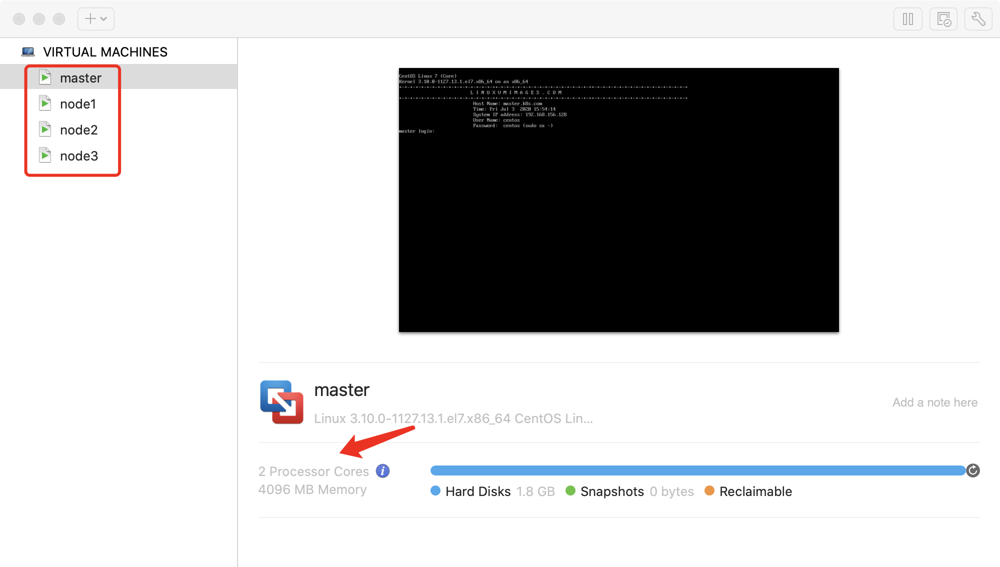
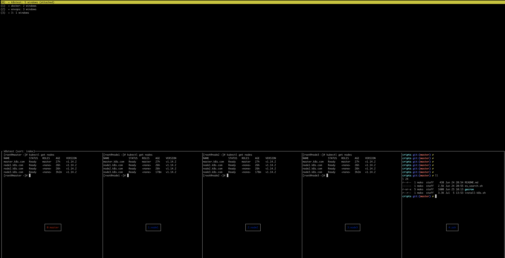
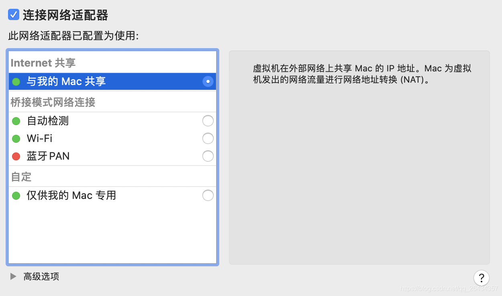

# Mac上搭建k8s集群实战

## 0、准备工作

> 下列所需软件可以从[地址](https://pan.baidu.com/s/1RyNsQpQ6oaesWTxrkx3vkw) 获取 提取码: `jtxj`

- macOS Catalina 10.15.5 系统
    - 16G 6core 
- VMware Fusion 11
    - 激活码: `7HYY8-Z8WWY-F1MAN-ECKNY-LUXYX`   
- CentOS_7.7.1908_VMM 
- 提前解决macOS Catalina系统Vmware Fusion虚拟机黑屏问题
    - 参考: https://zhuanlan.zhihu.com/p/108613520
    - 主要包括下面几步进行解决
        - 1)、重启按住 Command+R 进入恢复模式，找到实用工具在终端中输入 `csrutil disable`
            - 该命令的作用是关闭macOS的系统完整性保护机制
            - 系统显示“Successfully disabled System Integrity Protection. Please restart the machine for the changes to take effect”，表明macOS的系统完整性保护机制已经成功关闭了
            - 重启正常模式进入
        - 2)、修改vmware的配置，在系统TCC.db数据库中添加下面三个事件的权限
            - vmware Fusion的屏幕捕获（Screen Capture）
            - 事件监听（Listen Event）
            - 事件发送（Post Event）
        - 3)、修改 文件`"/Library/Application Support/com.apple.TCC/TCC.db"`
            ```bash
            sudo chmod 777 com.apple.TCC
            sudo rm -fr com.apple.TCC/TCC.db
            tccutil reset All com.vmware.fusion
            sudo sqlite3 "/Library/Application Support/com.apple.TCC/TCC.db" 'insert into access values ("kTCCServiceScreenCapture", "com.vmware.fusion", 0, 1, 1, "", "", "", "UNUSED", "", 0, 1565595574)'
            sudo sqlite3 "/Library/Application Support/com.apple.TCC/TCC.db" 'insert into access values ("kTCCServiceListenEvent",   "com.vmware.fusion", 0, 1, 1, "", "", "", "UNUSED", "", 0, 1565595574)'
            sudo sqlite3 "/Library/Application Support/com.apple.TCC/TCC.db" 'insert into access values ("kTCCServicePostEvent",     "com.vmware.fusion", 0, 1, 1, "", "", "", "UNUSED", "", 0, 1565595574)'
            ```
        - 4)、重启按照第一步进入恢复模式恢复系统的保护机制 `csrutil enable`

- 提前配置好[阿里云](https://cr.console.aliyun.com/cn-hangzhou/instances/mirrors)docker镜像加速器
    - 我的镜像加速地址 https://cxjmzodm.mirror.aliyuncs.com


---

## 1 环境检查

> 准备工作做好之后在VMware 中安装三个Centos虚拟机，节点规划及信息如下


节点        | 主机名            | ip  
---------   |---                | ---- 
master      | master.k8s.com    | 192.168.156.128
node1       | node1.k8s.com     | 192.168.156.129
node2       | node2.k8s.com     | 192.168.156.130
node3       | node3.k8s.com     | 192.168.156.131


- 1) 修改主机名 `hostnamectl set-hostname <hostname>`
- 2) 查看修改结果 `hostnamectl status`
- 3) 设置`hostname`解析

```
cat << EOF >> /etc/hosts
192.168.156.128 master.k8s.com
192.168.156.129 node1.k8s.com
192.168.156.130 node2.k8s.com
EOF
```
- 4) 检查网络，确保各个节点之间互通
- 5) 安装常用基础包

```
yum install -y vim wget yum-utils device-mapper-persistent-data lvm2 bash-completion
source /etc/profile.d/bash_completion.sh
```

- 6) 关闭防火墙
    - `systemctl stop firewalld && systemctl disable firewalld` 
- 7) 禁用selinux
    - `setenforce 0`
    - `sed -i "s/SELINUX=enforcing/SELINUX=disabled/g" /etc/selinux/config`
- 8) 关闭swap
    - `swapoff -a`
    - `yes | cp /etc/fstab /etc/fstab_bak`
    - `cat /etc/fstab_bak |grep -v swap > /etc/fstab`

### 2、Docker安装

- 设置docker源
    - `yum-config-manager --add-repo https://download.docker.com/linux/centos/docker-ce.repo`
- 安装Docker CE
    - `yum list docker-ce --showduplicates | sort -r`
    - `yum install -y docker-ce-18.09.6 docker-ce-cli-18.09.6 containerd.io`
- 启动docker
    - `systemctl start docker`
    - `systemctl enable docker`
- 配置镜像加速
    > exec-opt配置[参考](https://kubernetes.io/zh/docs/setup/production-environment/container-runtimes/#cgroup-%E9%A9%B1%E5%8A%A8%E7%A8%8B%E5%BA%8F)

    ```bash
    sudo tee /etc/docker/daemon.json <<-'EOF'
    {
      "registry-mirrors": ["https://cxjmzodm.mirror.aliyuncs.com"],
      "exec-opts": ["native.cgroupdriver=systemd"
    }
    EOF
    ```
- 重新加载docker
    - `systemctl daemon-reload && systemctl restart docker`

- 验证docker
    - `docker --version`
    - `docker run hello-world`

## 3、k8s安装

- 内核参数修改

    ```bash
    cat <<EOF >  /etc/sysctl.d/k8s.conf
    net.bridge.bridge-nf-call-ip6tables = 1
    net.bridge.bridge-nf-call-iptables = 1
    EOF
    ```
    - sysctl -p /etc/sysctl.d/k8s.conf
    
- 设置 kubernetes源

    ```bash
    cat <<EOF > /etc/yum.repos.d/kubernetes.repo
    [kubernetes]
    name=Kubernetes
    baseurl=https://mirrors.aliyun.com/kubernetes/yum/repos/kubernetes-el7-x86_64/
    enabled=1
    gpgcheck=1
    repo_gpgcheck=1
    gpgkey=https://mirrors.aliyun.com/kubernetes/yum/doc/yum-key.gpg https://mirrors.aliyun.com/kubernetes/yum/doc/rpm-package-key.gpg
    EOF
    ```
    - `yum clean all && yum -y makecache`

- 安装k8s
    > kubelet,kubectl, kubeadm 不要一次性 `yum install -y xxx xxx xxx`出错，[参考](https://www.codenong.com/cs107098459/)

    - `yum list kubelet --showduplicates | sort -r`
    - `yum install -y kubelet-1.14.2`
    - `yum install -y kubectl-1.14.2`
    - `yum install -y kubeadm-1.14.2`

- 启动kubelet并设置开机启动
    - `systemctl enable kubelet && systemctl start kubelet`
- kubelet命令补全
    - `echo "source <(kubectl completion bash)" >> ~/.bash_profile`
    - `source .bash_profile`

- 编辑下载镜像的脚本 image.sh
    > 镜像下载的地址为`k8s.gcr.io` 由于网络原因可以提前下载好；可参考[github](https://github.com/gotok8s/k8s-docker-desktop-for-mac)
    
    - `bash -x image.sh`
    
    ```bash
    #!/bin/bash
    url=registry.cn-hangzhou.aliyuncs.com/google_containers
    version=v1.14.2
    images=(`kubeadm config images list --kubernetes-version=$version|awk -F '/' '{print $2}'`)
    for imagename in ${images[@]} ; do
      docker pull $url/$imagename
      docker tag $url/$imagename k8s.gcr.io/$imagename
      docker rmi -f $url/$imagename
    done 
    ```

- `docker images`查看所需images信息 

    ```
    [root@master ~]# docker images
    REPOSITORY                                                                 TAG                 IMAGE ID            CREATED             SIZE
    quay.io/coreos/flannel                                                     v0.12.0-amd64       4e9f801d2217        3 months ago        52.8MB
    hello-world                                                                latest              bf756fb1ae65        6 months ago        13.3kB
    k8s.gcr.io/kube-proxy                                                      v1.14.2             5c24210246bb        13 months ago       82.1MB
    k8s.gcr.io/kube-apiserver                                                  v1.14.2             5eeff402b659        13 months ago       210MB
    k8s.gcr.io/kube-controller-manager                                         v1.14.2             8be94bdae139        13 months ago       158MB
    k8s.gcr.io/kube-scheduler                                                  v1.14.2             ee18f350636d        13 months ago       81.6MB
    k8s.gcr.io/coredns                                                         1.3.1               eb516548c180        17 months ago       40.3MB
    registry.cn-hangzhou.aliyuncs.com/kuberneters/kubernetes-dashboard-amd64   v1.10.1             f9aed6605b81        18 months ago       122MB
    k8s.gcr.io/etcd                                                            3.3.10              2c4adeb21b4f        19 months ago       258MB
    k8s.gcr.io/pause
    ```

> ==注意：以上内容需要在三个节点主机上分别设置, 可使用[脚本](https://raw.githubusercontent.com/pemako/to/master/k8s.sh)进行批量设置 ==


## 4、k8s相关设置

- 初始化`master`节点，仅需要在`master.k8s.com`的主机上设置即可
    - `kubeadm init --apiserver-advertise-address 192.168.156.128 --pod-network-cidr=10.244.0.0/16`
    - 看到成功提示信息后继续下面操作，失败则`kubeadm reset`后重新初始化
- 加载环境变量
    - `echo "export KUBECONFIG=/etc/kubernetes/admin.conf" >> ~/.bash_profile`
    - `source .bash_profile`
- 安装 pod 网络
    - `kubectl apply -f https://raw.githubusercontent.com/coreos/flannel/master/Documentation/kube-flannel.yml` 
    - 如有网络问题则可以从准备工作的软件包中下载

> 注意: 默认情况下集群不会在master上调度pod


##### 把`nodes`节点加入到集群中

> 下面几条命令下master节点执行，获取加入时候需要的token信息，如果过期怎么重新生成

- 查看令牌信息 
    - `kubeadm token list` 
    ```
    [root@master ~]# kubeadm token list
    TOKEN                     TTL       EXPIRES                     USAGES                   DESCRIPTION                                                EXTRA GROUPS
    fi723h.k2bjdiz8ehvw8vgz   1h        2020-07-04T15:55:34-04:00   authentication,signing   The default bootstrap token generated by 'kubeadm init'.   system:bootstrappers:kubeadm:default-node-token
    ```
    <!---->

    - 如过期重新生成
        - `kubeadm token create`
    - 生成新的加密串
        - `openssl x509 -pubkey -in /etc/kubernetes/pki/ca.crt | openssl rsa -pubin -outform der 2>/dev/null |    openssl dgst -sha256 -hex | sed 's/^.* //'`
        
> 下面分别把`node1` `node2` 节点加入到集群中

- `kubeadm join 192.168.156.128:6443 --token fi723h.k2bjdiz8ehvw8vgz --discovery-token-ca-cert-hash sha256:bf7b6f860e5bad38b3a99668f9115ea25c3c1c0cd8da8285fb7ce88babe2c855`
- `kubeadm join 192.168.156.128:6443 --token fi723h.k2bjdiz8ehvw8vgz --discovery-token-ca-cert-hash sha256:bf7b6f860e5bad38b3a99668f9115ea25c3c1c0cd8da8285fb7ce88babe2c855`

- 查看节点是否都正确添加,并且状态为 `Ready`

```
[root@master ~]# kubectl get nodes
NAME             STATUS   ROLES    AGE   VERSION
master.k8s.com   Ready    master   20h   v1.14.2
node1.k8s.com    Ready    <none>   19h   v1.14.2
node2.k8s.com    Ready    <none>   19h   v1.14.2
```

> ==到这里所有的集群部署及初始化完成，下面进行相关验证==

## 5、集群测试

- 命令方式部署应用
    - `kubectl run httpd-app --image=httpd --replicas=4`
    - 查看pods会有三个 httpd-app的pods生成
```
[root@master ~]# kubectl get pods
NAME                         READY   STATUS              RESTARTS   AGE
httpd-app-6df58645c6-2gk8x   0/1     ContainerCreating   0          54s
httpd-app-6df58645c6-6f9vw   0/1     ContainerCreating   0          54s
httpd-app-6df58645c6-qrs49   0/1     ContainerCreating   0          54s
```

- 通过命令行方式部署`nginx`服务，配置文件方式部署应用

```
cat >> nginx.yml << EOF
apiVersion: extensions/v1beta1
kind: Deployment
metadata:
  name: nginx
spec:
  replicas: 4
  template:
    metadata:
      labels:
        app: nginx
    spec:
      restartPolicy: Always
      containers:
      - name: nginx
        image: nginx:latest
EOF
```

- `kubectl apply -f nginx.yml`
- 查看节点状态 `kubectl get nodes`
- 查看pod状态 `kubectl get pod --all-namespaces`

```
[root@master ~]# kubectl get pod --all-namespaces -o wide
NAMESPACE     NAME                                     READY   STATUS    RESTARTS   AGE   IP                NODE             NOMINATED NODE   READINESS GATES
default       nginx-9d4cf4f77-c7f6d                    1/1     Running   0          93m   10.244.2.10       node2.k8s.com    <none>           <none>
default       nginx-9d4cf4f77-gh76b                    1/1     Running   0          10m   10.244.1.11       node1.k8s.com    <none>           <none>
default       nginx-9d4cf4f77-kmx5f                    1/1     Running   0          10m   10.244.1.10       node1.k8s.com    <none>           <none>
default       nginx-9d4cf4f77-q2dss                    1/1     Running   0          93m   10.244.2.9        node2.k8s.com    <none>           <none>
kube-system   coredns-fb8b8dccf-94swc                  1/1     Running   64         22h   10.244.0.8        master.k8s.com   <none>           <none>
.......
```

- 查看副本数 `kubectl get deployments`
    - 可以看到nginx被调度到平均调度到 node1 node2节点上

```
[root@master ~]# kubectl get deployments
NAME    READY   UP-TO-DATE   AVAILABLE   AGE
nginx   4/4     4            4           94m


[root@master ~]# kubectl get pod -o wide
NAME                    READY   STATUS    RESTARTS   AGE   IP            NODE            NOMINATED NODE   READINESS GATES
nginx-9d4cf4f77-c7f6d   1/1     Running   0          95m   10.244.2.10   node2.k8s.com   <none>           <none>
nginx-9d4cf4f77-gh76b   1/1     Running   0          12m   10.244.1.11   node1.k8s.com   <none>           <none>
nginx-9d4cf4f77-kmx5f   1/1     Running   0          12m   10.244.1.10   node1.k8s.com   <none>           <none>
nginx-9d4cf4f77-q2dss   1/1     Running   0          95m   10.244.2.9    node2.k8s.com   <none>           <none>
```

- 查看集群基本组件状态

```
[root@master ~]# kubectl get cs
NAME                 STATUS    MESSAGE             ERROR
controller-manager   Healthy   ok
scheduler            Healthy   ok
etcd-0               Healthy   {"health":"true"}
```


## 6、Dashboard安装

- 准备`kubernetes-dashboard.ymal`文件

```yaml
# Copyright 2017 The Kubernetes Authors.
#
# Licensed under the Apache License, Version 2.0 (the "License");
# you may not use this file except in compliance with the License.
# You may obtain a copy of the License at
#
#     http://www.apache.org/licenses/LICENSE-2.0
#
# Unless required by applicable law or agreed to in writing, software
# distributed under the License is distributed on an "AS IS" BASIS,
# WITHOUT WARRANTIES OR CONDITIONS OF ANY KIND, either express or implied.
# See the License for the specific language governing permissions and
# limitations under the License.

# ------------------- Dashboard Secrets ------------------- #

apiVersion: v1
kind: Secret
metadata:
  labels:
    k8s-app: kubernetes-dashboard
  name: kubernetes-dashboard-certs
  namespace: kube-system
type: Opaque

---

apiVersion: v1
kind: Secret
metadata:
  labels:
    k8s-app: kubernetes-dashboard
  name: kubernetes-dashboard-csrf
  namespace: kube-system
type: Opaque
data:
  csrf: ""

---
# ------------------- Dashboard Service Account ------------------- #

apiVersion: v1
kind: ServiceAccount
metadata:
  labels:
    k8s-app: kubernetes-dashboard
  name: kubernetes-dashboard
  namespace: kube-system

---
# ------------------- Dashboard Role & Role Binding ------------------- #

kind: Role
apiVersion: rbac.authorization.k8s.io/v1
metadata:
  name: kubernetes-dashboard-minimal
  namespace: kube-system
rules:
  # Allow Dashboard to create 'kubernetes-dashboard-key-holder' secret.
- apiGroups: [""]
  resources: ["secrets"]
  verbs: ["create"]
  # Allow Dashboard to create 'kubernetes-dashboard-settings' config map.
- apiGroups: [""]
  resources: ["configmaps"]
  verbs: ["create"]
  # Allow Dashboard to get, update and delete Dashboard exclusive secrets.
- apiGroups: [""]
  resources: ["secrets"]
  resourceNames: ["kubernetes-dashboard-key-holder", "kubernetes-dashboard-certs", "kubernetes-dashboard-csrf"]
  verbs: ["get", "update", "delete"]
  # Allow Dashboard to get and update 'kubernetes-dashboard-settings' config map.
- apiGroups: [""]
  resources: ["configmaps"]
  resourceNames: ["kubernetes-dashboard-settings"]
  verbs: ["get", "update"]
  # Allow Dashboard to get metrics from heapster.
- apiGroups: [""]
  resources: ["services"]
  resourceNames: ["heapster"]
  verbs: ["proxy"]
- apiGroups: [""]
  resources: ["services/proxy"]
  resourceNames: ["heapster", "http:heapster:", "https:heapster:"]
  verbs: ["get"]

---
apiVersion: rbac.authorization.k8s.io/v1
kind: RoleBinding
metadata:
  name: kubernetes-dashboard-minimal
  namespace: kube-system
roleRef:
  apiGroup: rbac.authorization.k8s.io
  kind: Role
  name: kubernetes-dashboard-minimal
subjects:
- kind: ServiceAccount
  name: kubernetes-dashboard
  namespace: kube-system

---
# ------------------- Dashboard Deployment ------------------- #

kind: Deployment
apiVersion: apps/v1
metadata:
  labels:
    k8s-app: kubernetes-dashboard
  name: kubernetes-dashboard
  namespace: kube-system
spec:
  replicas: 1
  revisionHistoryLimit: 10
  selector:
    matchLabels:
      k8s-app: kubernetes-dashboard
  template:
    metadata:
      labels:
        k8s-app: kubernetes-dashboard
    spec:
      containers:
      - name: kubernetes-dashboard
        image: registry.cn-hangzhou.aliyuncs.com/kuberneters/kubernetes-dashboard-amd64:v1.10.1
        ports:
        - containerPort: 8443
          protocol: TCP
        args:
          - --auto-generate-certificates
          # Uncomment the following line to manually specify Kubernetes API server Host
          # If not specified, Dashboard will attempt to auto discover the API server and connect
          # to it. Uncomment only if the default does not work.
          # - --apiserver-host=http://my-address:port
        volumeMounts:
        - name: kubernetes-dashboard-certs
          mountPath: /certs
          # Create on-disk volume to store exec logs
        - mountPath: /tmp
          name: tmp-volume
        livenessProbe:
          httpGet:
            scheme: HTTPS
            path: /
            port: 8443
          initialDelaySeconds: 30
          timeoutSeconds: 30
      volumes:
      - name: kubernetes-dashboard-certs
        secret:
          secretName: kubernetes-dashboard-certs
      - name: tmp-volume
        emptyDir: {}
      serviceAccountName: kubernetes-dashboard
      # Comment the following tolerations if Dashboard must not be deployed on master
      tolerations:
      - key: node-role.kubernetes.io/master
        effect: NoSchedule

---
# ------------------- Dashboard Service ------------------- #

kind: Service
apiVersion: v1
metadata:
  labels:
    k8s-app: kubernetes-dashboard
  name: kubernetes-dashboard
  namespace: kube-system
spec:
  ports:
    - port: 443
      targetPort: 8443
      nodePort: 30001
  type: NodePort
  selector:
    k8s-app: kubernetes-dashboard
---
apiVersion: v1
kind: ServiceAccount
metadata:
  name: dashboard-admin
  namespace: kube-system

---
apiVersion: rbac.authorization.k8s.io/v1beta1
kind: ClusterRoleBinding
metadata:
  name: dashboard-admin
subjects:
- kind: ServiceAccount
  name: dashboard-admin
  namespace: kube-system
roleRef:
  apiGroup: rbac.authorization.k8s.io
  kind: ClusterRole
  name: cluster-admin
```

- 部署Dashboard
    - kubectl apply -f kubernetes-dashboard.yaml
- 查看状态
    - `kubectl get deployment kubernetes-dashboard -n kube-system`
    ```
    [root@master ~]# kubectl get deployment kubernetes-dashboard -n kube-system
    NAME                   READY   UP-TO-DATE   AVAILABLE   AGE
    kubernetes-dashboard   1/1     1            1           30m
    ```
    - `kubectl get services -n kube-system`
- 查看令牌
    - `kubectl describe secrets -n kube-system dashboard-admin`
    
    ```
    [root@master ~]# kubectl describe secrets -n kube-system dashboard-admin
    Name:         dashboard-admin-token-xwcsc
    Namespace:    kube-system
    Labels:       <none>
    Annotations:  kubernetes.io/service-account.name: dashboard-admin
                  kubernetes.io/service-account.uid: fd1745bb-be20-11ea-9ef8-005056295e82
    
    Type:  kubernetes.io/service-account-token
    
    Data
    ====
    ca.crt:     1025 bytes
    namespace:  11 bytes
    token:      eyJhbGciOiJSUzI1NiIsImtpZCI6IiJ9.eyJpc3MiOiJrdWJlcm5ldGVzL3NlcnZpY2VhY2NvdW50Iiwia3ViZXJuZXRlcy5pby9zZXJ2aWNlYWNjb3VudC9uYW1lc3BhY2UiOiJrdWJlLXN5c3RlbSIsImt1YmVybmV0ZXMuaW8vc2VydmljZWFjY291bnQvc2VjcmV0Lm5hbWUiOiJkYXNoYm9hcmQtYWRtaW4tdG9rZW4teHdjc2MiLCJrdWJlcm5ldGVzLmlvL3NlcnZpY2VhY2NvdW50L3NlcnZpY2UtYWNjb3VudC5uYW1lIjoiZGFzaGJvYXJkLWFkbWluIiwia3ViZXJuZXRlcy5pby9zZXJ2aWNlYWNjb3VudC9zZXJ2aWNlLWFjY291bnQudWlkIjoiZmQxNzQ1YmItYmUyMC0xMWVhLTllZjgtMDA1MDU2Mjk1ZTgyIiwic3ViIjoic3lzdGVtOnNlcnZpY2VhY2NvdW50Omt1YmUtc3lzdGVtOmRhc2hib2FyZC1hZG1pbiJ9.ZSFNSVR561VS4QnkCPzBWUe8p4O25OBtWhZgpWSTzhIZP57vYzyoTCMW9KW08teSPGAlNwdGNl572UKowjKBSsrVNg-dCFpThls4T4AAKnFkxxsb3OysvCIrVYe18W319lGbvMvxqIXR-iZq3MU6mnhO-otznkA7W_Ob_PFJE5nx0yps-VYsA8s1kZJ9Z3KBJXPrMUavUzsEJReATf5LgHykdyTpC1KZjFXsDRAhPyvPXcxqjsRIZVwrOGb_Coc0Eb3ZnmceXU-sRAUG5EBJEifaabz3_8lDCp-MA7as4pFHfrSG4S0IzJnTmCDxGNpHOmnX-Fl58nd2jGx_2He1fQ
    ```
    
- web访问
    
    > 注意一定要使用https 通过token的方式访问；dashboard部署在了master节点（ip:192.168.156.128）映射的端口为 `30001` 故访问的时候直接使用 https://192.168.156.128:30001/ 即可
    
- 效果展示






## 7、问题及排错

- 在集群在节点运行kubectl出现的错误：The connection to the server localhost:8080 was refused - did you specify the right host or port?
    - [参考](https://blog.csdn.net/lfm940624/article/details/84706118)
    - 将主节点（master节点）中的【/etc/kubernetes/admin.conf】文件拷贝到从节点相同目录下:
    - 配置环境变量
    ```bash
    scp -r /etc/kubernetes/admin.conf ${node1}:/etc/kubernetes/admin.conf
    echo “export KUBECONFIG=/etc/kubernetes/admin.conf” >> ~/.bash_profile
    source ~/.bash_profile
    ```

- kubeadm 初始化主节点的相关错误
    > 初始化的时候回做一系列的检查是否符合条件，根据相关的错误进行设置即可，如会有下面几项需要设置。参考[kubeadm github](https://github.com/kubernetes/kubeadm/blob/master/docs/design/design_v1.10.md#kubeadm-init-phases) 
    
    - [error] if /proc/sys/net/bridge/bridge-nf-call-iptables file does not exist/does not contain 1.
    - [error] if swap is on
    - [warning] if firewalld is active
    - [error] if advertise address is ipv6 and /proc/sys/net/bridge/bridge-nf-call-ip6tables does not exist/does not contain 1.
    - ....

- vm的ip地址变更修改
    
    > 参考 ：https://zhuanlan.zhihu.com/p/109650921


## 8、设置虚拟机静态IP

> 设置虚拟机的IP为静态IP防止因为网络变更导致IP变更

### 8.1、设置Mac的 vmnet8

- 设定苹果机器上的 vmnet8网卡的网段和ip地址
```
➜  Downloads cat /Library/Preferences/VMware\ Fusion/networking
VERSION=1,0
answer VNET_1_DHCP yes
answer VNET_1_DHCP_CFG_HASH 5D225212161CE90EF3B07B1D1E35C7EA51D7680C
answer VNET_1_HOSTONLY_NETMASK 255.255.255.0
answer VNET_1_HOSTONLY_SUBNET 172.16.42.0
answer VNET_1_VIRTUAL_ADAPTER yes
answer VNET_8_DHCP no  #关闭dhcp
answer VNET_8_DHCP_CFG_HASH DA5D502E642D998635A74298B9119E5B27B66EEC
answer VNET_8_HOSTONLY_NETMASK 255.255.255.0  # 子网掩码
answer VNET_8_HOSTONLY_SUBNET 192.168.156.0   # IP段
answer VNET_8_NAT yes
answer VNET_8_VIRTUAL_ADAPTER yes
answer VNET_8_VIRTUAL_ADAPTER_ADDR 192.168.156.1  # vmnet8 的IP
add_bridge_mapping en0 2
```

- 设定nat的网关

```
➜  Downloads cat /Library/Preferences/VMware\ Fusion/vmnet8/nat.conf
# VMware NAT configuration file
# Manual editing of this file is not recommended. Using UI is preferred.

[host]

# NAT gateway address
ip = 192.168.156.2  # 设定nat网管和子网
netmask = 255.255.255.0
```

- 重启vmnet8网卡

```
# 查看网卡状态
sudo /Applications/VMware\ Fusion.app/Contents/Library/vmnet-cli --status  

#启动网卡
sudo /Applications/VMware\ Fusion.app/Contents/Library/vmnet-cli --start

# 关闭网卡
sudo /Applications/VMware\ Fusion.app/Contents/Library/vmnet-cli --stop
```

- 查看设置是否生效

```
➜  Downloads ifconfig | grep -C 3 vmnet8
vmnet1: flags=8863<UP,BROADCAST,SMART,RUNNING,SIMPLEX,MULTICAST> mtu 1500
        ether 00:50:56:c0:00:01
        inet 172.16.42.1 netmask 0xffffff00 broadcast 172.16.42.255
vmnet8: flags=8863<UP,BROADCAST,SMART,RUNNING,SIMPLEX,MULTICAST> mtu 1500
        ether 00:50:56:c0:00:08
        inet 192.168.156.1 netmask 0xffffff00 broadcast 192.168.156.255
```

### 8.2、配置centos的网卡

- 配置网卡

```bash
vim /etc/sysconfig/network-scripts/ifcfg-ens33

[root@master ~]# cat /etc/sysconfig/network-scripts/ifcfg-ens33
TYPE=Ethernet
PROXY_METHOD=none
BROWSER_ONLY=no
BOOTPROTO=static  # 设置为静态IP
DEFROUTE=yes
IPV4_FAILURE_FATAL=no
IPV6INIT=yes
IPV6_AUTOCONF=yes
IPV6_DEFROUTE=yes
IPV6_FAILURE_FATAL=no
IPV6_ADDR_GEN_MODE=stable-privacy
NAME=ens33
DEVICE=ens33
ONBOOT=yes              # 设置开机启动
IPV6_PRIVACY=no

IPADDR=192.168.156.128  # 设置IP地址
GATEWAY=192.168.156.2   # 设置网关
NETMASK=255.255.255.0   # 设定掩码
DNS1=8.8.8.8            # 设定DSN
DNS2=8.8.4.4

------------------------------------
# 设定网关的时候虚拟机的网络配置要的dsn要和这里的nameserver的值保持一致
[root@master ~]# cat /etc/resolv.conf
# Generated by NetworkManager
search k8s.com
nameserver 8.8.8.8
nameserver 8.8.4.4

```

- 重启网络服务

```
service network restart

或
systemctl restart network
```

### 8.3、虚拟机网络配置




## 9、k8s dashboard token 过期时间修改

- 直接修改deployment

```
 kubectl edit deployments kubernetes-dashboard -n kube-system
 
 # 找到containers.args 添加 --toker-ttl=秒数
    containers:
      - args:
        - --auto-generate-certificates
        - –token-ttl=2592000  # 这里设置30天过期
```

 - 在dashboard web界面上找到部署进行修改和上面修改一致

 - 查看dashboard的详细参数
    - https://github.com/kubernetes/dashboard/blob/master/docs/common/dashboard-arguments.md


### 附录参考

- https://github.com/kubernetes/kubeadm/blob/master/docs/design/design_v1.10.md#kubeadm-init-phases
- https://www.backendcloud.cn/2020/04/10/centos7-7-k8s-3nodes/
- https://developer.aliyun.com/article/754337