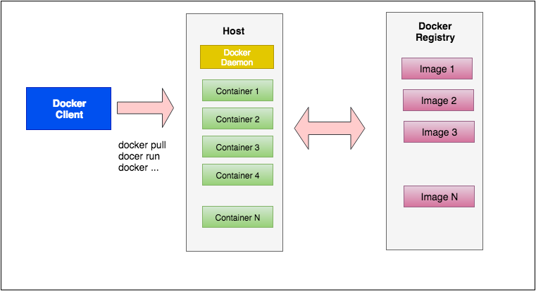
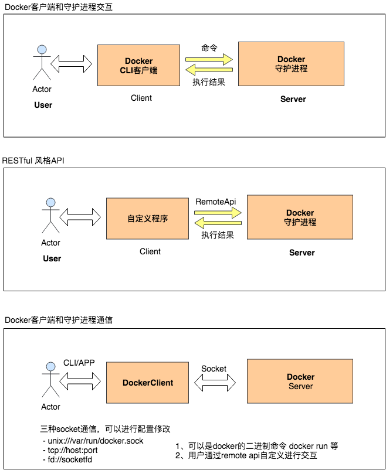
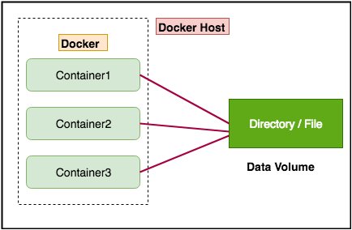
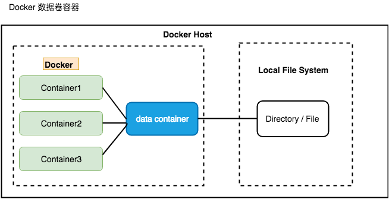
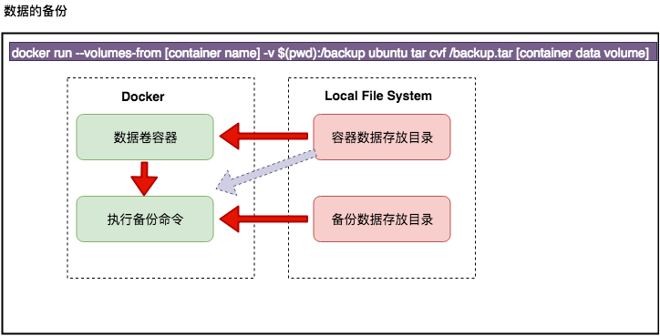

# docker-学习记录

使用Mac上进行docker的学习,使用的版本信息如下

```
Client: Docker Engine - Community
 Version:           18.09.2
 API version:       1.39
 Go version:        go1.10.8
 Git commit:        6247962
 Built:             Sun Feb 10 04:12:39 2019
 OS/Arch:           darwin/amd64
 Experimental:      false

Server: Docker Engine - Community
 Engine:
  Version:          18.09.2
  API version:      1.39 (minimum version 1.12)
  Go version:       go1.10.6
  Git commit:       6247962
  Built:            Sun Feb 10 04:13:06 2019
  OS/Arch:          linux/amd64
  Experimental:     false
```

## 0、环境初始化

- 方式一 `brew cask install docker` 这种安装方式不带GUI存命令行操作
- 方式二 下载 [Docker Desktop for Mac](https://hub.docker.com/editions/community/docker-ce-desktop-mac) 带一套可视化软件和Docker环境

## 1、Docker 的安装和配置

### 1.1 在Ubuntu中安装

- 检查环境是否支持
    - uname -a
    - ls -l /sys/class/misc/device-mapper

- 方式一 版本比较旧
	- `sudo apt-get install -y docker.io`
	- `source /etc/bash_completion.d/docker.io`

- 方式二
	- 检查APT的https支持，查看/usr/lib/apt/methods/https 文件是否存在
	    - apt-get update
	    - apt-get install -y apt-transport-https
	- 添加Docker的APT仓库
		- echo deb https://get.docker.com/ubuntu docker main >/etc/apt/sources.list.d/docker.list
	- 添加仓库的key
		- apt-key adv --keyserver hkp://keyserver.ubuntu.com:80 --recv-keys 36A1D7869245C8950F966E92D8576A8BA88D21E9
	- 安装
		- apt-get update
		- apt-get install -y lxc-docker

- Docker提供的简易安装方式
	- sudo apt-get install-y curl
	- curl -sSL https://get.docker.com/ | sudo sh 

- 新版本Docker安装
	- [参考官网文档](https://docs.docker-cn.com/engine/installation/linux/docker-ce/ubuntu/)

- 使用非root用户
	- sudo groupadd docker
	- sudo gpasswd -a user docker
	- sudo service docker restart


### 1.2 在window中安装

- 旧版本Docker

- 新版本Docker
	- 直接下载windows的docker进行安配置即可
	- [参考](https://docs.docker-cn.com/docker-for-windows/install/#start-docker-for-windows)

### 1.3 在MacOS中安装

- [参考官网文档](https://docs.docker-cn.com/docker-for-mac/install/#install-and-run-docker-for-mac)


## 2、Docker 简介

### 2.1 什么是容器

- 一种虚拟化的方案
- 操作系统级别的虚拟化
- 只能运行相同或相似内核的操作系统
- 依赖于Linux内核特性：`Namespace`和`Cgroups` (`Control Group`)

### 2.2 什么是Docker

- 将应用程序自动部署到容器
- Go语言开源引擎 Github地址: https://github.com/docker/docker
- 2013年初 dotCloud
- 基于Apache 2.0 开源授权协议发行 


### 2.3 Docker目标（特点）

- 提供简单轻量的建模方式
- 职责的逻辑分离
- 快速高效的开发生命周期
- 鼓励使用面向服务的架构

### 2.4 Docker的使用场景

- 使用Docker容器开发，测试，部署服务
- 创建隔离的运行环境
- 搭建测试环境
- 构建多用户的平台即服务（PaaS Platform as a Service）基础设施
- 提供软件即服务（SaaS Software as a Service）应用程序
- 高性能，超大规模的宿主机部署


## 3、Docker的基本组成




### 3.1 Docker客户端/守护进程




#### 连接方式

- 客户端和守护进程通信
	- unix:///var/run/docker.sock  (Docker 默认)
	- tcp://host:port
	- fd://socketfd

- 守护进程启动项修改
	- 详细参考[官网文档](https://docs.docker.com/engine/reference/commandline/cli/)
	- 修改启动配置文件(下面已Mac为例) 其余参考[官方文档](https://docs.docker.com/engine/reference/commandline/dockerd/#daemon-configuration-file)
		- 方式一直接修改 `vim ~/.docker/daemon.json`
		- 方式二 Docker->Preferences->Daemon->Advanced-> 直接进行配置json格式数据即可

- 访问远程的docker服务
	- `curl --unix-socket /var/run/docker.sock http:/v1.39/info`
	- [remote api](https://docs.docker.com/develop/sdk/)

### 3.2 Docker Image 镜像

#### 3.2.1 特点

- 容器的基石
- 层叠的只读文件系统
- 联合加载（union mount）

#### 3.3.2 基本操作

- 查找镜像
	- `docker search --no-trunc --limit=10  --filter stars=50  nginx`
	
	> 这个会在Docker的[官方仓库](https://hub.docker.com/)进行查找 

	> search的各个参数可以再[官方文档Search](https://docs.docker.com/engine/reference/commandline/search/) 进行详细查看


- 拉取镜像
	- `docker pull [OPTIONS] NAME[:TAG|@DIGEST]`
	- `docker pull ubuntu:16.04`


- 列出镜像
	- `docker image ls -a -q`
	- `docker image ls -f dangling=true` 列出悬空镜像
	> -a 列出所有镜像  -q仅列出image id

- 查看镜像详细信息
	- `docker [image] inspect id|name`

- 删除镜像
	- `docker image rm id|name`
	- `docker image rmi -f $(docker image ls -q)`
	- `docker image prune` 删除悬空镜像
	> 批量删除镜像

- 编译镜像
	- `docker image build ...`

- 构建镜像
	- `docker commit [OPTIONS] CONTAINER [REPOSITORY[:TAG]]`
		- `-a, --author string    Author`
  		- `-c, --change list      Apply Dockerfile instruction to the created image`
  		- `-m, --message string   Commit message`
  		- `-p, --pause            Pause container during commit (default true)`
  	- `docker commit -a mako -m test -p 容器 仓库:标签`
	
	- `Dockerfile 构建进行`
		- 新建一个目录下面创建Dockerfile文件
		- Dockerfile文件内容如下
		```
		FROM ubuntu
		MAINTAINER pemako "pemakoa@gmail.com"
		RUN apt-get update && apt-get install -y install vim
		EXPOSE 80
		```
		- `docker build -t='pemako/test' .`

- 推送镜像
	- `docker push [OPTIONS] NAME[:TAG]`


> 所有详细信息可以使用 `docker image --help` 查看支持的命令

> 已ls为例查看支持的选项 `docker image ls --help` 查看每个命令下支持的选项信息

> 更详细的信息参考[commandline docker](https://docs.docker.com/engine/reference/commandline/docker/)


#### 3.3.3 Dockerfile 指令

- FROM
	- 指定的镜像名必须是存在的
	- 这个镜像也叫做基础镜像
	- 在Dockerfile 中的第一条非注释的指令

- MAINTAINER
	- 指定镜像的所有者信息

- RUN 
	- 指定镜像中构建时的命令有下面两种模式
		- shell 模式 
		- exec 模式

- EXPOSE
	- 运行镜像使用的端口
	- 可以指定一个或多个端口

- CMD
	- 提供容器运行的默认行为
	- CMD command param1 parma2 (shell 模式)
	- CMD ["executable", "param1", "parma2"] (exec 模式)
	- CMD ["parma1", "parma2"] (作为ENTRYPOINT指令的默认参数)

- ENTRYPOINT
	- 会被docker run启动命令中的命令覆盖

- ADD
	- 将文件或目录复制到Dockerfile 
	- 包含类似tar的加压功能

- COPY
	- 单纯的复制推荐使用

- VOLUME
	- 基于镜像创建的容器添加卷

- WORKDIR
	- 在容器内部设定工作目录
	- 通常使用绝对路径

- ENV
	- 设置环境变量 ENV <key> <value>

- USER 
	- USER nginx 以 nginx 用户启动
	- USER user| user:group |user:gid |uid |uid:gid |uid:group

- ONBUILD [INSTRUCTION]
	- 镜像触发器
	- 当一个镜像被其他镜像作为基数镜像时执行
	- 会在构建过程中插入指令


#### 3.3.3 Dockerfile 构建过程

- 重基础镜像运行一个容器
- 执行一条指令，对容器做出修改
- 执行类似docker commit 的操作，提交一个新的镜像层
- 再基于刚才提交的镜像运行一个新容器
- 执行Dockerfile 中的下一条指令，直至所有的指令执行完成

- 构建缓存
	- 已经构建过的中间层会进行缓存，下次再构建
- 不使用缓存
	- `docker build --on-build选项`
	- `使用环境变量`

- 查看构建过程
	- `docker history [OPTIONS] IMAGE`

### 3.3 Docker Container 容器

#### 3.3.1 特点

- 通过镜像启动
- 启动和之行阶段
- 写时复制（copy on write）


#### 3.3.2 基本操作

- 启动容器 `docker run [OPTIONS] IMAGE [COMMAND] [ARG...]`
	- 1、单次命令容器 `docker run ubuntu echo 'Hello World'`

	> 表示启动容器并执行 echo 命令 对应的参数 为 'Hello World'

	- 2、交互模式启动 `docker run -i -t ubuntu /bin/bash`

- 列出容器 `docker ps [-a] [-l]`
	> -a 列出全部容器， -l列出最近的一个容器
	> 不指定参数返回的是在运行的容器

- 查看指定容器的详细信息 
	- `docker inspect [CONTAINER ID|NAMES]`

- 自定义容器名字执行
	- `docker run --name=container_name -i -t ubuntu /bin/bash`

- 重新启动停止容器
	- `docker start [-i] 容器名|或id`
	> -i 交互模式启动

- 删除已经停止的容器
	- `docker rm containerid`

- 导出容器
    - `docker export containerId > xxx.tar`

- 导入容器快照
    - `cat xxx.tar | docker import - test/ubuntu:v1.0`
    - `docker import http://example.com/exampleimage.tgz example/imagerepo`

#### 3.3.3 守护式容器

> 什么是是守护式容器：能够长期运行，没有交互式回话，适合运行应用程序和服务

- 启动方式一 
	- docker run -i -t IMAGE /bin/bash
	- Contrl + p + q 退出
	> 此时使用 `docker container ps` 查看容器是在运行的状态

	- docker attach 容器名|或id 
	> 重新进入刚才在后台运行的容器

- 使用RUN 启动守护式容器
	- docker run --name=mako1 -d ubuntu /bin/bash -c "while true; do echo hello world; sleep 1; done"
	> -d 已后台模式运行容器，命令结束后依旧会退出 + 加上循环保持容器不退出

- 查看容器日志查看容器运行
	- docker logs [-f] [-t] [-tail] 容器名|或id
	> -f --follows=true|false 默认为false	    一直跟踪日志变化并返回结果
	> -t --timestamps=true|false 默认为false 在返回结果上加上时间戳
	> --tail="all" 							返回最后多少条日志

	- docker logs -f  mako1
	- docker logs -ft mako1
	- docker logs -ft --tail=10 mako1

- 通过top命令查看运行中容器的进程情况
	- docker top mako1

- 在运行中的容器中启动新的进程
	- docker exec [-d] [-i] [-t] 容器名|或id [comamnd] [arg...]
	- docker exec -i -t /bin/bash
	- docker top mako1 查看新的进程是否存在

- 停止守护式容器
	- docker stop 容器名|或id	 会进行等待
	- docker kill 容器名|或id  快速停止

> 详细命令查看 docker --help 查看


#### 3.3.4 在容器中部署一个静态网站

> 通过NGINX部署静态网站

-  容器的端口映射
	- docker run [-P] [-p]
		- -P --public-all=true|false 默认为false 为容器暴露所有端口进行映射
			- docker run -P -i -t ubuntu /bin/bash
		- -p --publish=[]  指定映射哪些容器的端口
			- containerPort 只指定容器端口，宿主机端口随机映射
				- docker run -p 80 -i -t ubuntu /bin/bash
			- hostPort:containerPort 同时指定宿主机端口和容器端口
				- docker run -p 8080:80 -i -t ubuntu /bin/bash
			- ip:containerPort 指定IP和容器端口
				- docker run -p 0.0.0.0:80 -i -t ubuntu /bin/bash
			- ip:hostPort:containerPort 同时指定IP 宿主机端口和容器端口
				- docker run -p 0.0.0.0:8080:80 -i -t ubuntu /bin/bash

- 部署的流程
	- 创建映射80端口的交互式容器
	- 安装Nginx， vim
	- 创建静态页面
	- 修改Nginx配置文件
	- 运行Nginx
	- 验证网站访问

	```
	docker run -p 80 --name=web -i -t ubuntu /bin/bash
	apt-get update
	apt-get install -y nginx vim
	mkdir /var/www/html && cd /var/www/html
	vim index.html 进行编辑
	whereis nginx  
	# 查找nginx安装信息 nginx: /usr/sbin/nginx /usr/lib/nginx /etc/nginx /usr/share/nginx
	ls /etc/nginx/
	vim /etc/nginx/sites-enabled/default  # 修改root根目录
	nginx # 启动
	Contrl + p Contrl + q 退出
	```

	- 使用docker ps| docker prot  查看 发现 `0.0.0.0:32769->80/tcp` 把32769端口映射到容器中的80端口
	```
	➜  ~ docker port web
	80/tcp -> 0.0.0.0:32769
	➜  ~ docker top web
	PID                 USER                TIME                COMMAND
	28314               root                0:00                /bin/bash
	29952               root                0:00                nginx: master process nginx
	29953               xfs                 0:00                nginx: worker process
	29954               xfs                 0:00                nginx: worker process
	```

- 使用宿主机的地址访问网站
	- curl http://localhost:32769/
	- http://localhost:32769/
	- http://0.0.0.0:32769/

- 使用容器的IP地址访问
	- docker inspect web
	- 找到 "IPAddress": "172.17.0.2"
	- 直接访问 
	> 发现访问的时候网络不通[解决办法](https://my.oschina.net/shea1992/blog/2991407)

	> 在启动的时候 添加 --net=host 的网络选项 


### 3.4 Docker Registry 仓库

- 共有 Docker Hub
- 私有


## 4、Docker 容器相关技术简介

### 4.1 Namespace 命名空间

- 编程语言
	- 封装 -> 代码隔离
- 操作系统
	- 系统资源隔离
	- 进程、网络、文件系统...

- Docker提供五种隔离
	- PID (Process ID) 进程隔离
	- NET (Network) 管理网络接口
	- IPC (InterProcess Communication) 管理跨进程通信的访问
	- MUT (Mount)管理挂载点
    - UTS (Unix Timesharing System) 隔离内核和版本标识

### 4.2 Control Groups 控制组

- 用来分配资源，来源于google 
- Linux kernel 2.6.24@2007 整合

- 提供的功能
	- 资源限制
	- 优先级设定
	- 资源计量
	- 资源控制（挂起，恢复）

### 4.3 Docker容器的能力

- 文件系统隔离
	- 每个容器都有自己的root文件系统
- 进程隔离
	- 每个容器都运行在自己的进程环境中
- 网络隔离
	- 容器间的虚拟网络接口和IP地址都是分开的
- 资源隔离和分组
	- 使用cgroups将CPU和内存之类的资源独立分配给每个Docker容器


### 4.4 Docker容器的网络连接

#### 4.4.1 Docker容器的网络基础

> [注意](http://wudaijun.com/2017/11/docker-network/) Mac上使用需要注意

> [Docker For Mac]的实现和标准Docker规范有区别，Docker For Mac的Docker Daemon是运行于虚拟机(xhyve)中的(而不是像Linux上那样作为进程运行于宿主机)，因此Docker For Mac没有docker0网桥，不能实现host网络模式，host模式会使Container复用Daemon的网络栈(在xhyve虚拟机中)，而不是与Host主机网络栈，这样虽然其它容器仍然可通过xhyve网络栈进行交互，但却不是用的Host上的端口(在Host上无法访问)。bridge网络模式 -p 参数不受此影响，它能正常打开Host上的端口并映射到Container的对应Port。


- Linux虚拟网桥的特点
	- 可以设置IP地址
	- 相当于拥有一个隐藏的虚拟网卡

#### 4.4.2 Docker容器的互联

##### 1) 内部容器之间的连接

- 允许所有容器互联
	- `--icc=true` 同一宿主机下默认情况允许连接
	- 容器重启的是ip地址会发生改变

	>  容器启动时可以使用 --link=[CONTAINER_NAME]:[ALIAS] [IMAGE] [COMMAND] 解决重启IP地址发生变化

	> 后面访问可以使用 ALIAS 进行访问

	- `docker run -it --name cct3 --link=cct1:webtest pemako/cct`
	- `ping webtest`


- 拒绝容器间互联
	- Docker守护进程启动的时候设置 `--icc=false` 拒绝所有容器连接


- 允许特定容器间的连接
	
	> 修改下面三个配置可以允许部分容器间进行连接

	- `--icc=false` 
	- `--iptables=true`
	- `--link`  仅允许使用link选项配置的容器间连接


##### 2) 容器与外部网络的连接

> ip_forward、iptables、 允许端口映射访问、限制IP访问容器

- ip_forward
	- --ip-forward=true docker守护进程启动的时候默认允许流量转发
	- `sysctl net.ipv4.conf.all.forwarding` 使用系统命令查看是否开启
		- 结果 `net.ipv4.conf.all.forwarding = 1`

- iptables[详细参考](http://www.zsythink.net/archives/category/%E8%BF%90%E7%BB%B4%E7%9B%B8%E5%85%B3/iptables/page/2/)
	
	> [参考1](http://0cx.cc/iptables-flow-diagram.jspx)

	> Iptables 是与Linux内核集成的包过滤防火墙系统，激活所有的linux发型版本都会包含iptabel的功能
	
	- 表 table
		- nat
		- mangle
		- raw
		- filter
	- 链 chain
	- 规则 rule 是每个链下的操作
		- ACCEPT
		- REJECT
		- DROP

### 4.5 Docker容器的数据管理

#### 4.5.1 Docker容器的数据卷

> 什么是数据卷(Data Volume)

- 数据卷是经过特殊设置的目录，可以绕过联合文件系统（UFS），为一个或多个容器提供访问
- 数据卷设计的目的，在于数据的永久化，它完全独立与容器的生存周期，因此，Docker 不会再容器删除时删除其挂载的数据卷，也不会存在类似的垃圾收集机制，对容器引用的数据卷进行处理

> 数据卷的架构



- 数据卷是独立docker的存在与docker容器的生存周期是分离的
- docker数据卷是独立存储在docker宿主机的文件系统中
- docker数据卷可以是目录也可以是文件
- docker容器可以利用数据卷的技术与宿主机进行数据共享
- 同一个目录或文件支持多个容器间访问，实现容器间的数据共享

> 数据卷的特点

- 数据卷在容器启动时初始化，如果容器使用的镜像在挂载点包含了数据，这些数据会拷贝到新初始化的数据卷中
- 数据卷可以再容器之间共享和重用
- 可以对数据卷例的内容直接进行修改
- 数据卷的变化不会影响镜像的更新
- 卷会一直存在，及时挂在数据卷的容器已经被删除


> 为容器添加数据卷 -v 指定本机文件或目录:容器中的目录或文件

- `docker run -v ~/本机目录:/容器中目录 -it ubuntu /bin/bash`

> 为数据卷添加访问权限 指定目录映射后指定权限

- `sudo run -it -v ~/本机目录:/容器中目录:ro ubuntu /bin/bash`

> 使用Dockerfile 构建包含数据卷的镜像,没构建一次，本地目录都会重新创建，这种创建的数据卷不能共享；如果需要实现共享采用数据卷容器的方式

- VOLUME ["/data"] 不能映射到本次存在的目录或文件,


#### 4.5.2 Docker数据卷容器

> 命名的容器挂在数据卷，其他容器通过挂在这个容器实现数据共享，挂载数据卷的容器，就叫做数据卷容器



> 挂载数据卷容器的方法

- `docker run --volumes-from [CONTAINER NAME]`
	- 首先创建一个挂载书卷的容器 dev1
	- 创建一个新的容器并挂载 dev1
	- `docker run -it --name dev2 --volumes-from dev1 ubuntu /bin/bash`

#### 4.5.3 Docker数据卷的备份和还原

> 数据的备份方案

- `docker run --volumes-from [container name] -v $(pwd):/backup ubuntu tar cvf /backup.tar [container data volume]`

> 上面个的命令执行的效果如下图



> 数据还原方案

- `docker run --volumes-from [container name] -v $(pwd):/backup ubuntu tar xvf /backup.tar [container data volume]`


## 参考

- 1、[https://www.jishuwen.com/d/2ETn](https://www.jishuwen.com/d/2ETn)
- 2、[https://yeasy.gitbooks.io/docker_practice/](https://yeasy.gitbooks.io/docker_practice/)
- 3、[https://zhuanlan.zhihu.com/p/35792864](https://zhuanlan.zhihu.com/p/35792864)
- 4、[https://www.jianshu.com/p/9e11be3d74f0](https://www.jianshu.com/p/9e11be3d74f0)
- 5、[https://www.zhihu.com/question/20387284](https://www.zhihu.com/question/20387284)
- 6、[https://www.raywenderlich.com/9159-docker-on-macos-getting-started](https://www.raywenderlich.com/9159-docker-on-macos-getting-started)
- 7、[https://pjw.io/articles/2018/04/25/access-to-the-container-network-of-docker-for-mac/](https://pjw.io/articles/2018/04/25/access-to-the-container-network-of-docker-for-mac/)

## 待学习

- Github + Docker Hub 实现自动构建镜像 [https://blog.csdn.net/bbwangj/article/details/82084480](https://blog.csdn.net/bbwangj/article/details/82084480)
