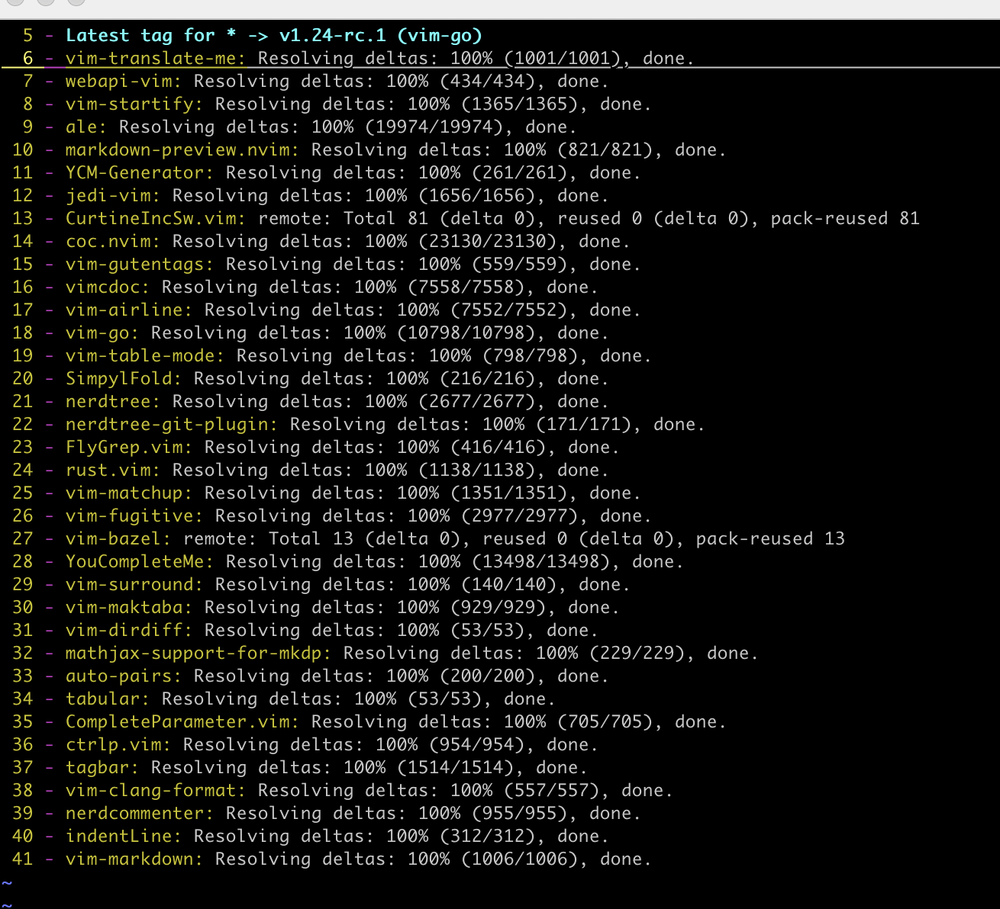
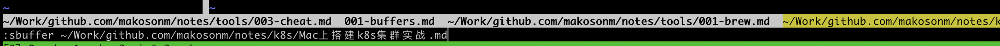
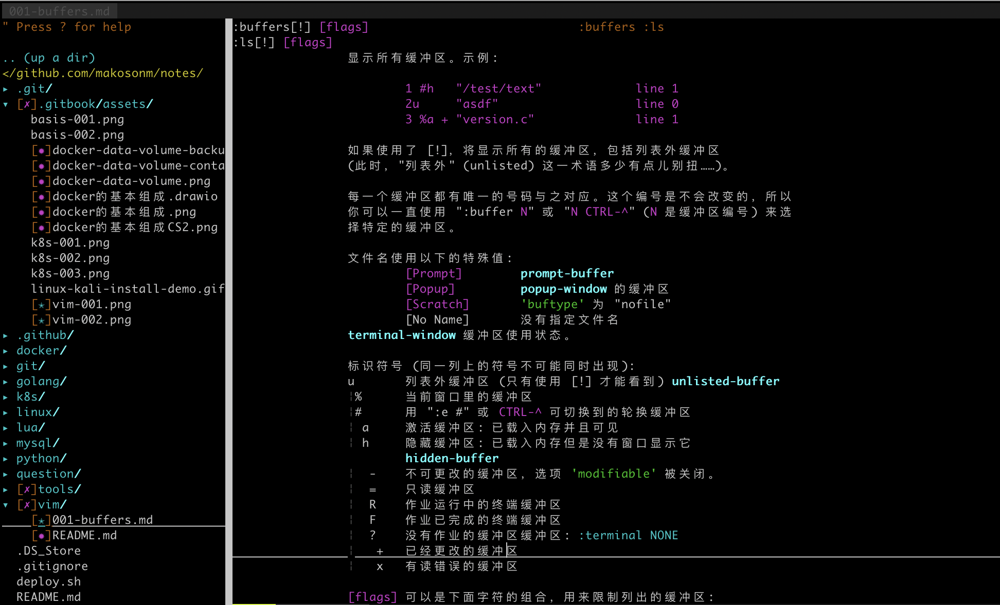

# Vim 中的缓冲区

##  增加缓冲区

在启动vi时，可以指定多个文件做为参数，例如vi file1 file2 file3，参数中的所有文件都会被载入缓冲区，但vi只会在窗口中显示第一个文件。
可以使用 `:ball`命令为每一个缓冲区打开一个窗口。

使用 `:badd filename` 命令将新增一个缓冲区。指定的文件会被加载到缓冲区列表中，但是对这个文件的编辑过程只有切换到那个缓冲区才会开始。
在命令中还可以指明为这个缓冲区打开窗口时，光标所处的位置：

```
:badd +linenum filename
```

## 列出缓冲区

`buffers`, `files`, `ls` 命令将会累出当前编辑中的缓冲区信息。在列表中，第一个数字是缓冲区的标号，第二个标记是缓冲区当前的状态，第
三个是与缓冲区所关联的文件名。



缓冲区状态包含下面几种情况

| 标记 | 说明  |
|------| --------|
| -     | Readonly buffer, 禁用了modifiable选项，只读缓冲区|
| =     | Readonly buffer, 只读缓冲区|
| a     | Active buffer, 活动缓冲区，当前显示在屏幕上|
| h     | Hidden buffer, 隐藏缓冲区，已载入但没有显示在屏幕上|
| +     | Modiffied buffer, 禁用了modifiable选项，只读缓冲区|
| x     | Error buffer, 读入时报错的缓冲区|
| %     | Current buffer, 当前缓冲区|
| #     | Alternate buffer, 交换缓冲区 |
| u     | Unlisted buffer, 只有在列式命令中使用 ! 修饰符才能显示的缓冲区|
| |
## 选择缓冲区

- 使用`number`参数，选择的hiing标号的缓冲区

```
:buffer number
```

- 使用文件名选择缓冲区

```
:buffer filename    
```

- 使用 `subffer` 命令

```
:subffer filename

:subffer number
```




## 切换缓冲区

- `:bnext` 下一个缓冲区
- `:bprevious` 或 `:bNext` 前一个缓冲区
- `:blast` 最后一个缓冲区
- `:bfirst` 第一个缓冲区

## 删除缓冲区

- `:bdelete filename` 
- `:bdelete 3` 或 `:3 bdelete` 删除一个缓冲区
- `:1,3 bdelete` 删除指定范围的缓冲区
- `:bdelete! filename` 强制删除缓冲区，缓冲区中的所有改动都会被放弃

## 卸载缓冲区

- `:bunload` 会从内存中卸载一个缓冲区，所有为这个缓冲区打开的窗口也会关闭。但是这个文件名仍然会存在于缓冲区列表中
- `:bunload!` 强制卸载缓冲区，但所有的改动也将会丢失

## 帮助信息


使用 `:help buffers` 命令查看缓冲区的帮助信息


