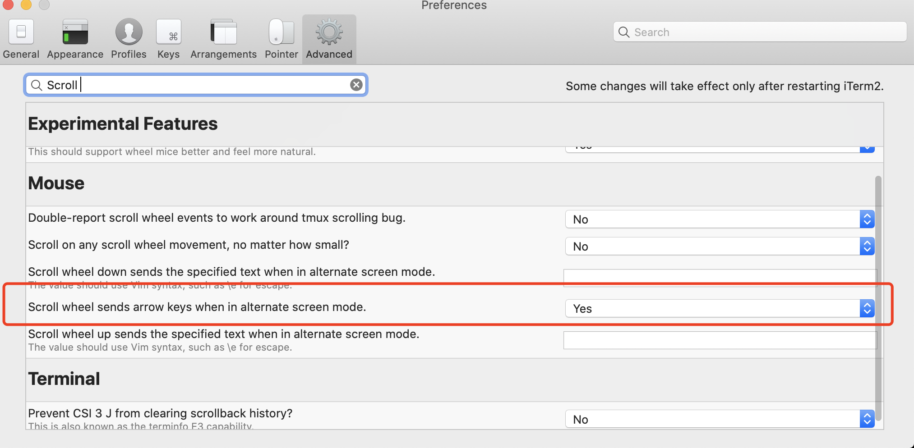

# tmux 使用

## 安装

```
brew install tmux
```

## 配置

- 插件安装

```
git clone https://github.com/tmux-plugins/tpm ~/.tmux/plugins/tpm
```

- 全局配置

```
# Enable mouse mode (tmux 2.1 and above)
set -g mouse on

#Enable oh my zsh in tmux
set -g default-command /bin/zsh

# Mouse based copy
bind-key -T copy-mode-vi MouseDragEnd1Pane send -X copy-pipe-and-cancel "reattach-to-user-namespace pbcopy"
bind-key -T copy-mode MouseDragEnd1Pane send -X copy-pipe-and-cancel "reattach-to-user-namespace pbcopy" 

set -g @continuum-boot 'on'                         # Automatic Tmux start
set -g @continuum-restore 'on'                      # Last saved environment is automatically restored when tmux is started
set -g @continuum-boot-options 'iterm,fullscreen'   # start iTerm in fullscreen

# tmux 的插件管理
set -g @plugin 'tmux-plugin/tpm'
set -g @plugin 'tmux-plugins/tmux-sensible'

set -g @plugin 'tmux-plugins/tmux-resurrect'
set -g @plugin 'tmux-plugins/tmux-continuum'

# Initialize TMUX plugin manager (keep this line at the very bottom of tmux.conf)
run -b '~/.tmux/plugins/tpm/tpm'
```

- 重载配置文件生效

```
tmux source ~/.tmux.conf
```


## 常用命令


```
# To start tmux:
tmux

# To detach from tmux:
Ctrl-b d

# To restore tmux session:
tmux attach

# To detach an already attached session (great if you are moving devices with different screen resolutions):
tmux attach -d 

# To display session:
tmux ls

# To rename session:
Ctrl-b $

# To switch session:
Ctrl-b s

# To start a shared session:
tmux -S /tmp/your_shared_session
chmod 777 /tmp/your_shared_session

# To help screen (Q to quit):
Ctrl-b ?

# To scroll in window:
Ctrl-b PageUp/PageDown

# To reload configuation file
Ctrl-b : source-file /path/to/file

# To create a window:
Ctrl-b c

# To go next window:
Ctrl-b n

# To destroy a window:
Ctrl-b x

# To switch between windows:
Ctrl-b [0-9]
Ctrl-b Arrows

# To split windows horizontally:
Ctrl-b %

# To split windows vertically:
Ctrl-b "

# To swap windows:
Ctrl-b :swap-window -s [0-9] -t [0-9]
```


## 问题总结

### iterm下滚动问题

进入iterm2 的设置 `Advanced` 搜索 Scroll 找到 Mouse 下 `Scroll wheel sends arrow keys when in alternate screen mode.` 修改为 `Yes`。如下图


